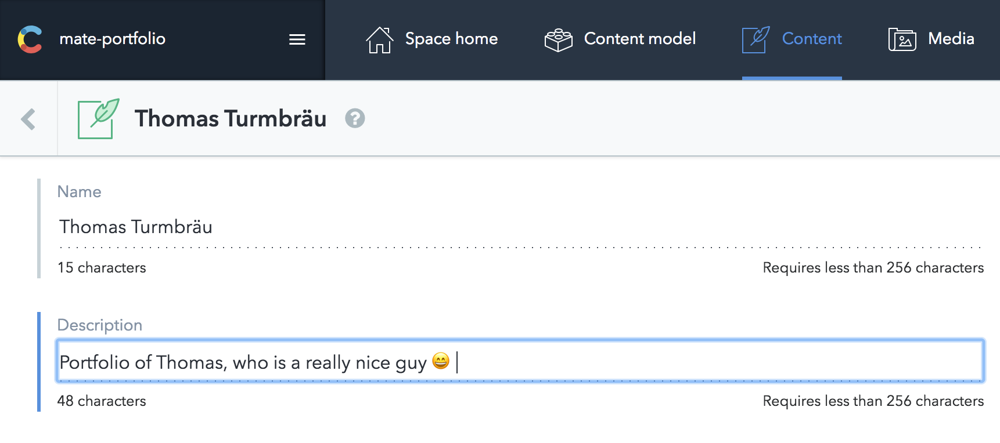

# Byron Delpinal Website

[](https://travis-ci.org/EmaSuriano/gatsby-starter-mate)
[](https://eslint.org/)
[](https://github.com/prettier/prettier)
[](https://percy.io/Ema-suriano/gatsby-starter-mate)


A place for Byron Delpinal to put things on the web.

> I'm standing on the shoulder of giants, using the Mate Starter template for Gatsby. If you're a fan of the design/concept, you should [buy Ema Suriano a coffee](https://www.buymeacoffee.com/emasuriano).

## Features 🛠

- [Gatsby v2](https://www.gatsbyjs.org/)
- [Rebass 3.0 🎉](https://rebassjs.org/): styled component system
- [React Reveal](https://www.react-reveal.com/)
- Dynamic content from [Contentful](https://contentful.com)
- Offline support
- PWA ready
- SEO
- Responsive design
- Icons from [font-awesome](https://fontawesome.com/)
- [Netlify](https://www.netlify.com) Deployment Friendly
- Medium integration
- Social sharing (Twitter, Facebook, Google, LinkedIn)
- Developer tools:
  - `eslint`
  - `prettier`
- Google Analytics integration
- End to End with Cypress:
  - A11y testing with [Axe](https://www.deque.com/axe/)
  - Visual Testing with [Percy](https://percy.io/)

## How to start ▶️

If you never used Gatsby before, I highly recommend you to [Set up your development environment](https://www.gatsbyjs.org/tutorial/part-zero/)!

To copy and install this starter run this command:

```bash
$ gatsby new mate-portfolio https://github.com/EmaSuriano/gatsby-starter-mate
```

At this point you have the repository download with all the dependencies installed, but if you try to start by running `yarn develop` you are going to received this message in the console:

```bash
  TypeError: Expected parameter accessToken
```

This is because you didn't specify from which `Contentful` space the portfolio will take the information. So the next step is create an empty space in [Contentful](https://www.contentful.com/)!

After the space is created, run the following command:

```bash
yarn setup
```

This CLI will request 3 values:

- `Space ID`
- `Content Delivery API - access token`
- `Personal Access Token`

These 3 values are inside the Settings section --> API keys.

After you provide them the CLI will automatically starts copying all the `Content models` and `Contents` from `mate-demo-contentful` to your space ✨

If everything went smooth you should see something like this in your terminal:

```text
Writing config file...
Config file /Users/my-user/Git/test/mate-portfolio/.env written
┌──────────────────────────────────────────────────┐
│ The following entities are going to be imported: │
├─────────────────────────────────┬────────────────┤
│ Content Types                   │ 3              │
├─────────────────────────────────┼────────────────┤
│ Editor Interfaces               │ 3              │
├─────────────────────────────────┼────────────────┤
│ Entries                         │ 8              │
├─────────────────────────────────┼────────────────┤
│ Assets                          │ 6              │
├─────────────────────────────────┼────────────────┤
│ Locales                         │ 1              │
├─────────────────────────────────┼────────────────┤
│ Webhooks                        │ 0              │
└─────────────────────────────────┴────────────────┘
 ✔ Validating content-file
 ✔ Initialize client (1s)
 ✔ Checking if destination space already has any content and retrieving it (2s)
 ✔ Apply transformations to source data (1s)
 ✔ Push content to destination space
   ✔ Connecting to space (1s)
   ✔ Importing Locales (1s)
   ✔ Importing Content Types (4s)
   ✔ Publishing Content Types (3s)
   ✔ Importing Editor Interfaces (3s)
   ✔ Importing Assets (7s)
   ✔ Publishing Assets (3s)
   ✔ Archiving Assets (1s)
   ✔ Importing Content Entries (1s)
   ✔ Publishing Content Entries (5s)
   ✔ Archiving Entries (1s)
   ✔ Creating Web Hooks (0s)
Finished importing all data
```

After this step we can finally run the project and see the result in http://localhost:8000/ 😃

```bash
$ yarn start
```

## Building your site 📦

As we are dealing with environment variables, the `.env` file is excluded from `.gitignore` file. Therefore, in order to deploy the website you have to send `SPACE_ID` and `ACCESS_TOKEN` with the `build` command.

```bash
SPACE_ID=xxxxx ACCESS_TOKEN=yyyyy yarn build
```

The result will be stored inside the `public` folder, so you can upload to your web host. I highly suggest using this starter with Netlify when you can define which command will build the project and also send the environment variables inside the website configuration.

## Adding your information 📝

All the text of this starter live inside Contentful, specifically inside the Content of `About`. In order to change it, just go to `Content` section and change the entity of About with the information you want.



Regarding the projects and social links the process is the same! Contentful is really easy to learn so don't be afraid of breaking everything, remember that you can restore to the start point by running `yarn setup` 😄

## End to End Testing with Cypress 🧪

The starter comes with a built in End to End Setup using Cypress. As there are no complex logic flow, there are only two tests in place:

1. Accessibility check: using the [cypress-axe](https://www.npmjs.com/package/cypress-axe) plugin you can easily check a lot of a11y rules at once powered by [Axe](https://www.deque.com/axe/)!
2. Visual testing: using [percy-cypress](https://github.com/percy/percy-cypress) plugin you can take screenshot with different resolutions and easily the difference inside their platform. [Here](https://percy.io/Ema-suriano/gatsby-starter-mate) you can check the Percy dashboard for this project.

## Tracking with Google Analytics 📈

There's an analytics plugin inside the `gatsby-config`, so the only need to do in order to enable it is to provide the `Tracking Id` for your site (starts with `UA-`). Just set a new variable inside your `.env` file called `ANALYTICS_ID` and analytics will be turn on automatically 😄
